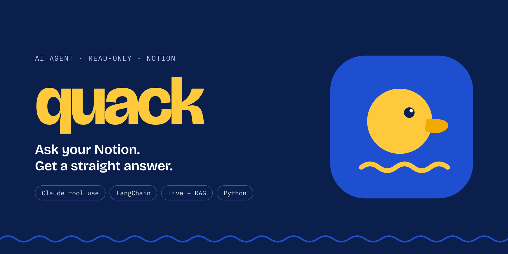

# 🦆 Quack

A read-only agent that answers questions about my Notion workspace. Structured questions ("which Odysseys are in progress?") go to the live Notion API. Fuzzy ones ("where did I write about the sequence of tenses?") go to a local Chroma index. Every question leaves a request-id-linked trace.

## How it works

```
React chat UI  --SSE-->  FastAPI  -->  agent (Claude tool use)  -->  router  -->  Notion client (3 req/s, cache, budget)
                                                                         \-->  Chroma index (kept fresh by the indexer)
```

- **Agent:** a hand-rolled `tool_use` loop (`quack/agent.py`) and the same agent on LangChain (`quack/agent_lc.py`, used by the API).
- **Tools:** `search_notion`, `query_database`, `get_page` (live) and `semantic_search` (index, with a freshness check against Notion and a live fallback).
- **Budgets:** each question gets a tool-step, Notion-request and time budget (`quack/budget.py`). When one runs out, the agent is forced to answer with what it has and name what it could not check.
- **Index:** `python -m quack index` pulls pages edited since the last checkpoint, chunks and embeds them locally (Chroma's default model), and upserts them. Manual trigger only.
- **Evals:** `python -m evals` scores answers and traces separately, so a correct answer reached by a wasteful path is visible.

## Setup

```
python -m venv .venv && .venv\Scripts\activate
pip install -r requirements-dev.txt
cp .env.example .env        # ANTHROPIC_API_KEY, NOTION_API_KEY
cd ui && npm install
```

## Run

```
python -m quack "What are today's Agoge rituals?"      # hand-rolled loop
python -m quack --lc "..."                             # LangChain agent
python -m quack index [--full] [--limit N]             # build or refresh the index
uvicorn quack.api:app --reload --port 8000             # chat API
cd ui && npm run dev                                   # chat UI on :5173
python -m evals [--ids a,b] [--repeat N]               # score against evals/questions.json
```

## Test

```
python -m pytest
cd ui && npm run check && npm run e2e
```

The design lives in [`docs/PLAN.md`](docs/PLAN.md).
