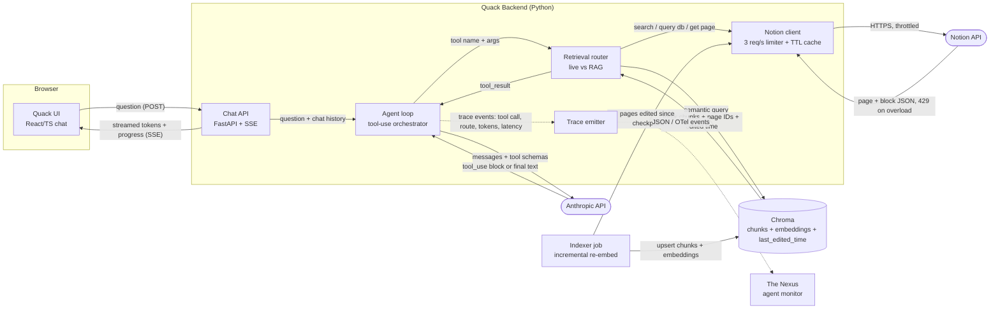
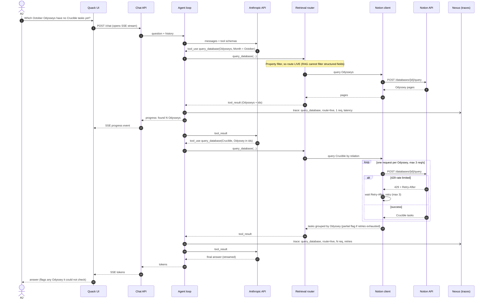

# Quack — Build Plan

**Learning objective:** Understand agentic architecture from the wire up: the raw Claude tool-use loop, what LangChain abstracts on top of it, and how an agent plans multi-step retrieval under a hard rate limit.
**Stack:** React + TypeScript (chat UI) / Python — Anthropic SDK, then LangChain, served by FastAPI with SSE / Chroma (local) + Notion API / traces to The Nexus
**MVP:** A local web chat where AJ asks real questions about his Notion workspace (read-only) and gets correct, streamed answers, drawn from live Notion calls or the Chroma index, whichever fits the question.

## What you'll have at the end
A chat window on your machine that answers questions like "which October Odysseys have no Crucible tasks yet?" or "where did I write about the sequence of tenses?". Structured questions go to the live Notion API and fuzzy ones go to a Chroma index kept fresh incrementally. Every tool call, routing decision and token count is emitted as a trace event, so The Nexus can pick Quack up as its first monitored agent without Quack changing.

## Architecture decisions
- **Read-only MVP** *(your call)*: no page edits or DB writes. Write access needs confirm-before-write guardrails, which is a different project.
- **Python LangChain backend, React/TS UI** *(your call)*: breaks from your .NET default on purpose, since the agent ecosystem lives in Python.
- **Live tool calls first, RAG second** *(your call)*: you learn the tool loop without a vector store muddying it, then RAG arrives as a second route rather than a replacement.
- **Chroma over Pinecone** *(recommended)*: local and free, and the objective is agent reasoning, not vector-ops. It sits behind a retriever interface, so swapping later touches one module.
- **Hand-roll the loop, then port to LangChain** *(recommended)*: once you've written the `tool_use` → `tool_result` loop yourself, LangChain's abstraction is something you understand rather than something you trust blindly.
- **Incremental re-index keyed on `last_edited_time`** *(recommended)*: the index is a derived copy of Notion, so staleness is a design problem you solve deliberately, not a bug you discover.
- **One shared Notion client with a rate limiter and short-lived cache** *(plan's call)*: the 3 requests/second limit is per integration, so the agent and the indexer must share one budget.
- **FastAPI + Server-Sent Events** *(plan's call)*: token streaming and progress events are one-way, server to browser. SSE is simpler than WebSockets for that.
- **Embeddings from Chroma's default local model** *(plan's call)*: Anthropic has no embeddings endpoint, and a local model keeps indexing free and offline.
- **Single user, no auth, in-memory chat history** *(plan's call)*: it runs on your machine. The data model keys history by session id, so persistence can come later.
- **Next door: Nexus observability** *(recommended)*: structured trace events from day one. Tracing is fire-and-forget, so Quack never blocks on Nexus.

## System design
**Designed against:** the Notion API averages 3 requests/second per integration (429 above that), the workspace has thousands of pages, and a question needing 20+ fetches must still return a useful answer within about 15 seconds with visible progress.

> Provenance: your first attempt had no backend (UI → Chroma/Anthropic directly, Anthropic → Notion). Both diagrams below were drawn by Claude after grading, at your request. The first thing Phase 1 does is make you redraw them yourself.

Container view: every process, store and third party, with what crosses each edge.

Multi-step flow: the two-hop question, including the rate-limit path.

**Open questions:**
- Is the per-Odyssey loop in the sequence diagram even necessary? If the Odysseys pages already expose their Crucible relation, the second hop may collapse into the first. Phase 3 finds out.
- What does the router key on: tool name, Claude's own choice, or a classifier? The diagram hides this inside one box.
- How should Notion blocks be chunked so a Chroma hit carries enough context to answer from?
- What is the right step budget before the agent gives up and returns a partial answer?
- How much chat history fits before it crowds out tool results in the context window?

---

## Phase 1 — The hand-rolled tool loop
**Goal:** A question typed at a terminal is answered using live Notion data through a tool loop you wrote by hand. No framework.
**Concept in focus:** The `tool_use` → execute → `tool_result` round trip: Claude decides, your code acts.
**Builds:** Agent loop, Anthropic API edge, Notion client (with limiter), Notion API edge, Trace emitter (to a local file).

### Milestone 1.1 — One question, one tool, end to end
Write a Python script with the Anthropic SDK that exposes a single `search_notion` tool, runs the loop until Claude returns final text, and prints the answer. Start with a Notion integration shared with only a few pages.

- **Concept:** Tool schemas and the message loop, because every later phase, LangChain included, is this loop with more wrapping.
- **Checkpoint:** Redraw both diagrams from memory in Mermaid and diff them against this file. Then explain cold which process opens the connection to `api.notion.com` and what gets appended to `messages` afterward.

### Milestone 1.2 — A Notion client that respects the limit
Put every Notion call behind one client that enforces 3 requests/second, honors `Retry-After` on a 429, and gives up cleanly after a few retries with a result marked as partial.

- **Concept:** Client-side rate limiting and backoff, because the design constraint lives here and the indexer will share this budget in Phase 4.
- **Checkpoint:** Break it deliberately: set the limit to 10 requests/second and fire a burst. Predict how many 429s you'll get and what Claude sees in the `tool_result`, then run it and check.

### Milestone 1.3 — Trace events from the first line
Emit one structured event (JSON lines to a file) per tool call and per Claude turn: tool name, arguments, latency, input/output tokens, and a request id that ties one question's events together.

- **Concept:** Observability as a boundary, because this file format is the contract The Nexus will consume, and adding it later means retrofitting every call site.
- **Checkpoint:** From the trace file alone, without the console output, reconstruct exactly what the agent did for one question and what it cost.

---

## Phase 2 — Port to LangChain, add tools and a UI
**Goal:** The same agent runs on LangChain with three tools, behind a streaming chat UI.
**Concept in focus:** What an agent framework abstracts, and what it hides from you.
**Builds:** Chat API (FastAPI + SSE), Quack UI, the UI ↔ API edges, and the full live half of the Retrieval router.

### Milestone 2.1 — Parity port
Rebuild the Phase 1 agent with LangChain's Anthropic chat model and its agent runtime. Keep your trace events working by hooking LangChain's callbacks into your emitter.

- **Concept:** Framework vs. hand-rolled, because you can only judge the abstraction if the same questions give the same traces both ways.
- **Checkpoint:** Defend the choice: write three sentences on what LangChain's agent does that your loop didn't, one thing your loop made visible that LangChain hides, and when you'd skip the framework.

### Milestone 2.2 — Three tools Claude chooses between well
Add `query_database` (property filters) and `get_page` (full page + blocks) alongside `search_notion`. Spend real effort on the tool descriptions and argument schemas.

- **Concept:** Tool design is prompt design, because Claude picks tools from their descriptions and a vague one sends every question to `search`.
- **Checkpoint:** Write down which tool Claude should pick for eight varied questions, then run them and read the traces. Every miss should lead to a description fix, not a code fix.

### Milestone 2.3 — Streaming chat with progress
Serve the agent over FastAPI with SSE. The React/TS UI renders tokens as they arrive and shows progress events ("querying Odysseys… 4/6") between tool calls.

- **Concept:** Perceived latency, because the 15-second budget is survivable only if the user can see work happening.
- **Checkpoint:** Kill the backend mid-answer. Predict what the UI shows, check, and then make it say something true.

---

## Phase 3 — Multi-step reasoning under a budget
**Goal:** Quack reliably answers questions that need several dependent tool calls, within the rate limit and time budget, and says so honestly when it can't finish.
**Concept in focus:** Agent planning: decomposition, step budgets, stopping conditions and partial answers.
**Builds:** The multi-hop path of the sequence diagram, plus cache and batching inside the Notion client. **Stresses Phase 1:** the naive one-request-per-item loop from the diagram will blow the budget on real data, so this phase rewrites it.

### Milestone 3.1 — An eval set before any tuning
Write ten real multi-hop questions about your workspace, each with its known correct answer, and a small runner that scores Quack against them and records request counts and latency from the traces.

- **Concept:** Evaluating agents, because without a fixed yardstick every prompt tweak feels like progress.
- **Checkpoint:** Explain cold why an agent eval scores the final answer and the trace (step count, requests) separately, and what a correct answer reached by a wasteful path tells you.

### Milestone 3.2 — Budgets, stops and partial answers
Cap tool steps and Notion requests per question. When a cap is hit, the agent answers with what it has and names what it couldn't check, instead of looping or failing silently.

- **Concept:** Stopping conditions, because an agent without them turns a rate limit into an infinite retry bill.
- **Checkpoint:** Set the request cap to 5 and run the October Odysseys question. Predict the exact wording shape of the partial answer before you run it.

### Milestone 3.3 — The Odysseys question within budget
Use the traces to cut requests: relation data already on the parent pages, compound filters, cache hits for repeated lookups, and parallel tool calls where Claude issues them. Resolve the first open question above.

- **Concept:** Reading your own traces as a profiler, because the fix is almost never in the model and almost always in how many round trips you make.
- **Checkpoint:** Redraw the sequence diagram from memory to match what Quack now does, and diff it against this file. Update the file with whatever changed.

---

## Phase 4 — Hybrid retrieval with Chroma
**Goal:** Fuzzy questions are answered from a Chroma index kept fresh incrementally, and a router picks live or RAG per tool call, with a staleness fallback.
**Concept in focus:** Retrieval routing and derived-data freshness.
**Builds:** Indexer, Chroma, the Router's RAG path, and the staleness check. **Breaks Phase 2's assumption** that all retrieval is live.

### Milestone 4.1 — Incremental indexer
A job that pulls pages edited since the last checkpoint through the shared Notion client, chunks them, embeds them with the local model, and upserts into Chroma with page id and `last_edited_time` on every chunk.

- **Concept:** Change-data capture on a source you don't own, because a full rebuild of thousands of pages at 3 requests/second is not an option.
- **Checkpoint:** Edit one Notion page, run the indexer, and predict exactly how many Notion requests and Chroma upserts happen. Check against the traces.

### Milestone 4.2 — `semantic_search` and the router
Add a `semantic_search` tool over Chroma and make routing explicit. Structured filters go live, and "where did I write about…" goes to RAG. Log the route decision on every trace event.

- **Concept:** Routing as a design decision, because the wrong route either misses structured data (RAG) or burns the rate limit (live) on a fuzzy question.
- **Checkpoint:** Extend the eval set with five fuzzy questions. From memory, state which route each should take and why, then read the traces.

### Milestone 4.3 — Staleness fallback
When a RAG hit's `last_edited_time` is older than what Notion reports for that page (a cheap metadata check), fetch the page live and trigger a re-index for it.

- **Concept:** Treating derived data as suspect, because a confidently wrong answer from a stale index is worse than a slow correct one.
- **Checkpoint:** Delete the Chroma directory mid-session. Predict what the user sees, check, and make sure Quack degrades to live-only instead of erroring.

---

## MVP is done when
- The full eval set (ten multi-hop, five fuzzy) passes with correct answers, and every run stays under the request cap.
- The October Odysseys question streams its first progress event almost immediately and finishes within the design budget.
- A Notion outage, a 429 burst, or an empty Chroma index each produce an honest partial answer, never a stack trace or a silent spinner.
- Every question leaves a complete, request-id-linked trace The Nexus could ingest unchanged.
- You can redraw both diagrams from memory and they match the code.

## Deliberately not in the MVP
- Write access (organizing pages, DB writes) and its confirm-before-write guardrails
- Persistent chat history across sessions
- Auth / multi-user
- The Nexus UI itself (Quack only emits the events)
- Pinecone or any hosted vector store
- Scheduled or webhook-driven indexing (manual trigger only)
- Deployment beyond your machine

---

## As built (2026-10-10)

What the code does today, where it departs from the diagrams above. Redrawing the diagrams from memory (checkpoints 3.3 and the MVP list) is still yours to do.

- **Budgets, not just retries.** Each question runs under a `Budget` (`quack/budget.py`): 12 tool calls, 40 Notion requests, 90 seconds. A tripped cap makes tools return a stop instruction, and the next model call is forced to answer (`tool_choice: none`), in both the hand-rolled loop and the LangChain agent (middleware). The `done` event carries `budget_exhausted` and the UI shows a notice.
- **Cache inside the Notion client.** Identical reads within 60 seconds are served from a TTL cache and cost no budget. The staleness check and the indexer bypass it (`fresh=True`).
- **Parallel tool calls.** The hand-rolled loop runs the tool calls of one turn concurrently. The shared limiter still spaces the HTTP requests.
- **Router.** `quack/router.py` names the route for every tool call: `live` (search, query, get_page), `rag` (semantic_search) or `live_fallback` (the index was empty or unavailable). The route is written on every `tool_call` trace event and shown on finished steps in the UI.
- **Indexer.** `python -m quack index` lists pages sorted by `last_edited_time` (newest first, one request per 100 pages), stops at the checkpoint, then indexes oldest first so the checkpoint only ever advances past pages that were stored. A page that fails freezes the checkpoint so it is retried. Cost of a run: listing requests plus one block read per changed page.
- **Staleness fallback.** For each `semantic_search` hit, one uncached `GET /pages/{id}` compares `last_edited_time`. Newer in Notion: re-index that page (at most 3 per call) and return the live text, flagged `refreshed`. Beyond the cap or on errors: flagged `stale` or `unchecked`. Deleted or trashed pages are removed from the index and dropped.
- **Counting.** `aggregate_database` counts and groups server-side (up to 2000 rows) because `query_database` is capped at 100 rows. The first eval run failed "which Ultimate has the most Crucible tasks" for exactly that reason, and the answer said so honestly ("at least 131") instead of guessing.
- **Degradation.** Any Chroma error becomes `IndexUnavailable` and the tool falls back to a live keyword search with a warning. On Windows, deleting `.chroma/` while the API is running may fail because the files are open; stop the API first.
- **Answering the open questions.** The per-Odyssey loop and the right step budget are measured by `python -m evals`; fill them in from your own traces.

## Addendum: model selection (2026-10-10)

The chat UI has a model dropdown (Opus 5.5 default, Sonnet 5.5). `config.MODELS` is the allowlist and `config.MODEL` stays the default. `GET /models` feeds the dropdown, `POST /chat` takes an optional `model` (422 if unknown), and `streaming.stream_events` passes it to `agent_lc.run`. The CLI and the hand-rolled loop still use `config.MODEL`. Checkpoint: ask the same question on both models and compare the `model` field and token counts in the two traces.
